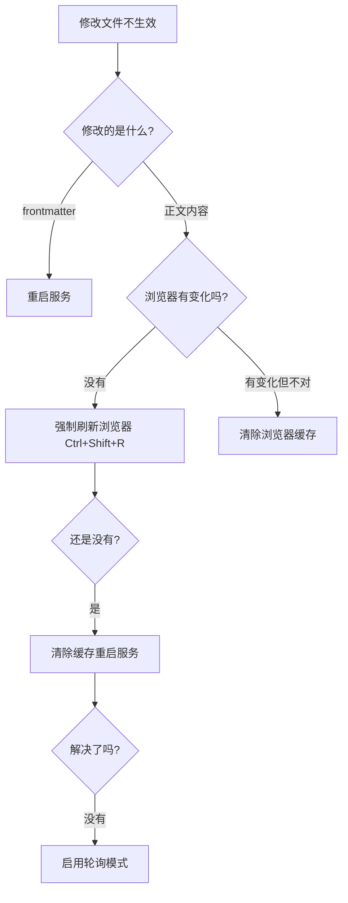

# 常见问题排查指南

## 1. 热更新(HMR)不生效 🔥

### 问题描述
修改 Markdown 文件保存后,浏览器页面没有自动刷新更新内容。

### 原因分析

#### ❌ **修改了 frontmatter**
frontmatter 的修改通常不会触发热更新,需要手动重启服务。

```yaml
---
title: 修改这里     # ❌ 不会热更新
description: 修改这里  # ❌ 不会热更新
tag:
 - 修改标签         # ❌ 不会热更新
---

# 修改这里         # ✅ 会热更新
正文内容修改        # ✅ 会热更新
```

#### ❌ **VitePress 缓存问题**
`.vitepress/cache` 目录缓存了构建结果,可能导致更新不及时。

#### ❌ **文件监听失效**
- 文件路径过长或包含特殊字符
- 文件数量过多
- 网络驱动器或虚拟机共享目录

#### ❌ **浏览器缓存**
浏览器缓存了旧的页面内容。

### 解决方案

#### 🔧 **方案 1: 清除缓存重启(最常用)**

```bash
# 1. 停止服务 (Ctrl+C)

# 2. 删除缓存目录
rmdir /s /q docs\.vitepress\cache
# 或者 (Git Bash/Linux/Mac)
rm -rf docs/.vitepress/cache

# 3. 重新启动
pnpm dev
```

#### 🔧 **方案 2: 强制刷新浏览器**

| 操作系统 | 快捷键 |
|---------|--------|
| Windows | `Ctrl + Shift + R` 或 `Ctrl + F5` |
| Mac | `Cmd + Shift + R` |
| Linux | `Ctrl + Shift + R` |

#### 🔧 **方案 3: 手动重启服务**

修改 frontmatter 后必须重启:
```bash
# Ctrl+C 停止服务
pnpm dev  # 重新启动
```

#### 🔧 **方案 4: 启用轮询模式(解决文件监听失效)**

编辑 `.vitepress/config.mts`,取消以下注释:

```typescript
vite: {
  server: {
    watch: {
      // 启用轮询模式
      usePolling: true,     // 取消这行注释
      interval: 1000,       // 取消这行注释
    }
  }
}
```

**注意**: 轮询模式会增加 CPU 使用率,仅在热更新确实有问题时使用。

#### 🔧 **方案 5: 检查 IDE 自动保存**

**VS Code 设置:**

1. 打开设置: `Ctrl + ,`
2. 搜索 `auto save`
3. 设置为 `afterDelay`

或者编辑 `settings.json`:
```json
{
  "files.autoSave": "afterDelay",
  "files.autoSaveDelay": 1000
}
```

**确保文件已保存:**
- 查看文件标签是否有 `●` 或 `*` 标记(表示未保存)
- 手动按 `Ctrl+S` 保存

### 快速诊断流程



---

## 2. 构建失败 ❌

### 问题描述
运行 `pnpm build` 时报错。

### 常见错误

#### Error: ENOENT: no such file or directory

**原因**: 文件或目录不存在

**解决方案:**
```bash
# 检查文件路径是否正确
# 检查配置中引用的图片、文件是否存在

# 常见位置:
# - public/ 目录下的静态资源
# - frontmatter 中的 cover 图片路径
# - 配置文件中的 logo、avatar 等
```

#### Out of memory (内存不足)

**原因**: 构建过程消耗内存过大

**解决方案:**
```bash
# 方案 1: 增加 Node.js 内存限制
$env:NODE_OPTIONS="--max-old-space-size=4096"  # Windows PowerShell
# 或
export NODE_OPTIONS="--max-old-space-size=4096"  # Linux/Mac

pnpm build

# 方案 2: 禁用不必要的功能
# 编辑 .vitepress/blog-theme.ts
# 关闭 mermaid、搜索等功能
```

#### Pagefind 构建超时

**原因**: pagefind 搜索索引构建时间过长

**解决方案:**
```bash
# 方案 1: 手动安装 pagefind
pnpm add -D pagefind

# 方案 2: 禁用搜索
# 编辑 .vitepress/blog-theme.ts
search: false,

# 方案 3: 增加超时时间
# 等待构建完成,通常是网络问题
```

---

## 3. 样式不生效 🎨

### 问题描述
自定义的 CSS 样式没有生效。

### 解决方案

#### 🔧 **检查样式文件是否正确引入**

`.vitepress/theme/index.ts`:
```typescript
import BlogTheme from '@sugarat/theme'

// 确保导入了自定义样式
import './style.css'  // ✅ 取消注释

export default BlogTheme
```

#### 🔧 **检查 CSS 选择器优先级**

主题的样式优先级可能更高,需要提高自定义样式的优先级:

```css
/* ❌ 优先级可能不够 */
.blog-item {
  color: red;
}

/* ✅ 提高优先级 */
.blog-item.blog-item {
  color: red !important;
}
```

#### 🔧 **清除浏览器缓存**

1. 打开浏览器开发者工具 (`F12`)
2. 右键点击刷新按钮
3. 选择"清空缓存并硬性重新加载"

或者使用快捷键: `Ctrl + Shift + R`

---

## 4. 图片不显示 🖼️

### 问题描述
Markdown 中的图片无法显示。

### 解决方案

#### 🔧 **检查图片路径**

**正确的路径格式:**

```markdown
<!-- ✅ 使用 public 目录(推荐) -->

<!-- 实际路径: docs/public/images/photo.jpg -->

<!-- ✅ 使用相对路径 -->

<!-- 相对于当前 md 文件的路径 -->

<!-- ✅ 使用外部链接 -->


<!-- ❌ 错误:直接使用文件系统路径 -->

```

#### 🔧 **检查文件名**

- 避免使用中文文件名
- 避免使用空格
- 推荐使用小写字母和连字符: `my-image.jpg`

#### 🔧 **检查文件格式**

支持的图片格式:
- ✅ `.jpg` / `.jpeg`
- ✅ `.png`
- ✅ `.gif`
- ✅ `.webp`
- ✅ `.svg`

---

## 5. 端口被占用 🔌

### 问题描述
启动服务时提示端口已被占用。

### 解决方案

#### 🔧 **方案 1: 关闭占用端口的程序**

**Windows:**
```bash
# 查找占用 5173 端口的进程
netstat -ano | findstr :5173

# 结束进程 (PID 是上一步查到的进程 ID)
taskkill /PID <PID> /F
```

**Mac/Linux:**
```bash
# 查找占用 5173 端口的进程
lsof -i :5173

# 结束进程
kill -9 <PID>
```

#### 🔧 **方案 2: 修改端口**

编辑 `.vitepress/config.mts`:
```typescript
vite: {
  server: {
    port: 8080,  // 修改为其他端口
  }
}
```

---

## 6. 评论系统不显示 💬

### 问题描述
配置了 Giscus 评论,但页面上不显示评论区。

### 解决方案

#### 🔧 **检查配置是否正确**

`.vitepress/blog-theme.ts`:
```typescript
comment: {
  type: 'giscus',
  options: {
    repo: '用户名/仓库名',          // ✅ 格式必须正确
    repoId: 'R_xxx',               // ✅ 必须是真实的 ID
    category: 'Announcements',      // ✅ 分类名称必须存在
    categoryId: 'DIC_xxx',         // ✅ 必须是真实的 ID
    // ...
  }
}
```

#### 🔧 **获取正确的配置参数**

1. 访问 https://giscus.app/zh-CN
2. 按照步骤配置
3. 复制生成的配置参数
4. 粘贴到配置文件

#### 🔧 **检查仓库设置**

确保 GitHub 仓库:
- ✅ 是公开仓库(public)
- ✅ 已安装 Giscus App
- ✅ 已开启 Discussions 功能

#### 🔧 **检查文章配置**

文章 frontmatter 中可能禁用了评论:
```yaml
---
comment: false  # ❌ 会禁用评论
---
```

---

## 7. 搜索功能异常 🔍

### 问题描述
搜索框不显示或搜索不到内容。

### 解决方案

#### 🔧 **确保搜索功能已启用**

`.vitepress/blog-theme.ts`:
```typescript
search: true,  // ✅ 确保没有设置为 false
```

#### 🔧 **重新构建搜索索引**

```bash
# 完整构建(会重新生成搜索索引)
pnpm build

# 如果构建时间过长,手动安装 pagefind
pnpm add -D pagefind
```

#### 🔧 **检查文章是否被索引**

确保文章:
- ✅ 不在 `.vitepress` 目录下
- ✅ frontmatter 中没有 `hidden: true`
- ✅ frontmatter 中没有 `publish: false`

---

## 8. 部署后样式丢失 🌐

### 问题描述
部署到 GitHub Pages 等平台后,样式不正常。

### 解决方案

#### 🔧 **配置正确的 base 路径**

如果部署在子路径(如 `username.github.io/blog`):

`.vitepress/config.mts`:
```typescript
export default defineConfig({
  base: '/blog/',  // ✅ 必须配置 base
  // ...
})
```

#### 🔧 **更新资源路径**

如果配置了 base,所有绝对路径都需要加上 base:

```typescript
// 错误 ❌
head: [
  ['link', { rel: 'icon', href: '/favicon.ico' }]
]

// 正确 ✅
const base = '/blog/'
head: [
  ['link', { rel: 'icon', href: `${base}favicon.ico` }]
]
```

---

## 9. Git 提交时出错 📦

### 问题描述
Git 提交时报错或警告。

### 解决方案

#### 🔧 **忽略不需要提交的文件**

确保 `.gitignore` 包含:
```gitignore
# 依赖
node_modules/

# 构建产物
dist/
.vitepress/dist/

# 缓存
.vitepress/cache/
.temp/

# 环境变量
.env
.env.local

# IDE
.vscode/
.idea/
```

#### 🔧 **处理大文件警告**

如果提示文件过大:
```bash
# 方案 1: 使用 Git LFS
git lfs install
git lfs track "*.jpg"
git lfs track "*.png"

# 方案 2: 将大文件移到 CDN
# 使用图床服务存储图片
```

---

## 10. 快速诊断清单 ✅

遇到问题时,按顺序检查:

- [ ] 文件是否已保存? (`Ctrl+S`)
- [ ] 是否修改了 frontmatter? (需要重启)
- [ ] 浏览器是否强制刷新? (`Ctrl+Shift+R`)
- [ ] 是否清除了缓存? (`rm -rf docs/.vitepress/cache`)
- [ ] 服务是否重启? (`Ctrl+C` 然后 `pnpm dev`)
- [ ] 配置文件语法是否正确? (检查是否有语法错误)
- [ ] 依赖是否安装完整? (`pnpm install`)
- [ ] Node.js 版本是否支持? (推荐 v18+)

---

## 11. 获取帮助 🆘

如果以上方案都无法解决问题:

1. **查看官方文档**
   - VitePress: https://vitepress.dev
   - @sugarat/theme: https://theme.sugarat.top

2. **查看错误日志**
   - 开发服务器的终端输出
   - 浏览器控制台 (`F12`)

3. **搜索相关问题**
   - GitHub Issues: https://github.com/ATQQ/sugar-blog/issues
   - Stack Overflow

4. **提交 Issue**
   - 提供完整的错误信息
   - 提供复现步骤
   - 提供环境信息(Node.js 版本、系统等)

---

## 12. 常用命令速查 ⚡

```bash
# 开发
pnpm dev                    # 启动开发服务器
pnpm build                  # 构建生产版本
pnpm serve                  # 预览构建结果

# 清理
rm -rf node_modules         # 删除依赖
rm -rf docs/.vitepress/cache  # 删除缓存
rm -rf docs/.vitepress/dist   # 删除构建产物

# 重装
pnpm install                # 安装依赖
pnpm add @sugarat/theme@latest  # 更新主题

# Git
git status                  # 查看状态
git add .                   # 添加所有修改
git commit -m "消息"        # 提交
git push                    # 推送
```

---

## 总结

大部分问题都可以通过以下三板斧解决:

1. **清除缓存** → `rm -rf docs/.vitepress/cache`
2. **重启服务** → `Ctrl+C` + `pnpm dev`
3. **强制刷新** → `Ctrl+Shift+R`

记住这三个操作,90% 的问题都能解决! 💪
